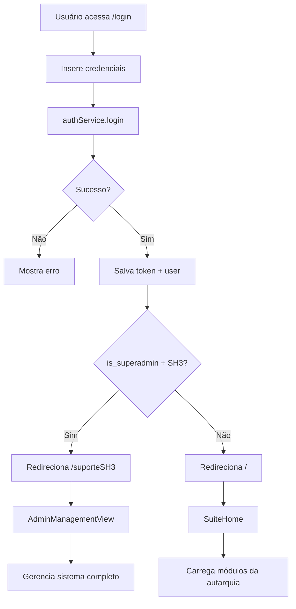

# 📘 Documentação da Implementação do Frontend

## Sistema de Gestão de Frota - Controle Granular de Acesso

**Versão:** 1.0.0
**Data:** 16 de Outubro de 2025
**Autor:** Equipe SH3

---

## 📋 Índice

1. [Visão Geral](#visão-geral)
2. [Arquitetura](#arquitetura)
3. [Tipos e Interfaces](#tipos-e-interfaces)
4. [Serviços (Services)](#serviços-services)
5. [Composables](#composables)
6. [Componentes](#componentes)
7. [Views](#views)
8. [Roteamento](#roteamento)
9. [Autenticação e Autorização](#autenticação-e-autorização)
10. [Fluxos de Uso](#fluxos-de-uso)
11. [Guia de Manutenção](#guia-de-manutenção)

---

## 🎯 Visão Geral

### Objetivo

Implementar um sistema frontend completo com controle granular de acesso baseado em:
- **Autarquias**: Entidades governamentais isoladas
- **Módulos**: Funcionalidades do sistema (Frota, Compras, etc.)
- **Permissões**: Controle fino de acesso (leitura, escrita, exclusão, admin)

### Características Principais

- ✅ **Multi-tenancy**: Cada autarquia vê apenas seus módulos
- ✅ **Controle de Acesso**: Superadmin SH3 tem acesso total
- ✅ **Interface Genérica**: Componentes reutilizáveis
- ✅ **TypeScript**: Tipagem forte e segurança
- ✅ **Vue 3 + Composition API**: Código moderno e reativo
- ✅ **PrimeVue**: UI components profissionais

---

## 🏗️ Arquitetura

### Estrutura de Diretórios

```
frontend/src/
├── types/              # Definições TypeScript
│   ├── auth.ts         # User, Autarquia, Modulo
│   └── table.ts        # Configs de tabela
│
├── services/           # Comunicação com API
│   ├── auth.service.ts
│   ├── user.service.ts
│   ├── autarquia.service.ts
│   ├── modulos.service.ts
│   ├── role.service.ts
│   ├── permission.service.ts
│   └── autarquia-modulo.service.ts
│
├── composables/        # Lógica reutilizável
│   ├── useModulos.ts
│   ├── useUserTableConfig.ts
│   ├── useAutarquiaTableConfig.ts
│   └── useModuloTableConfig.ts
│
├── components/         # Componentes Vue
│   ├── common/
│   │   ├── GenericTable.vue
│   │   └── GenericForm.vue
│   ├── usuario/
│   │   ├── UserTable.vue
│   │   ├── UserForm.vue
│   │   └── UsuarioCard.vue
│   └── select/
│       └── AutarquiaSelect.vue
│
├── views/              # Páginas
│   ├── LoginView.vue
│   ├── SuiteView.vue
│   └── suporte/
│       └── AdminManagementView.vue
│
└── router/             # Configuração de rotas
    └── index.ts
```

### Padrões Utilizados

| Padrão | Descrição | Localização |
|--------|-----------|-------------|
| **Service Layer** | Isola lógica de API | `services/*.service.ts` |
| **Composables** | Lógica reutilizável | `composables/*.ts` |
| **Generic Components** | Componentes configuráveis | `components/common/` |
| **Type Safety** | TypeScript em tudo | `types/*.ts` |

---

## 📝 Tipos e Interfaces

### 1. Auth Types (`types/auth.ts`)

#### Interface `Autarquia`
```typescript
export interface Autarquia {
  id: number;
  nome: string;
  ativo: boolean;
}
```

**Campos:**
- `id`: Identificador único
- `nome`: Nome da autarquia (ex: "Prefeitura Municipal")
- `ativo`: Se a autarquia está ativa

#### Interface `Modulo`
```typescript
export interface Modulo {
  id: number;
  nome: string;
  descricao?: string;
  icone?: string;
  ativo: boolean;
  // Legacy fields para compatibilidade
  key?: string;
  title?: string;
  description?: string;
  icon?: string;
  route?: string;
}
```

**Campos:**
- `id`: Identificador único
- `nome`: Nome do módulo (ex: "Frota")
- `descricao`: Descrição opcional
- `icone`: Nome do ícone (ex: "FrotaIcon" ou "pi pi-car")
- `ativo`: Se o módulo está ativo

#### Interface `User`
```typescript
export interface User {
  id: number;
  name: string;
  email: string;
  cpf: string;
  role: string;
  autarquia_id: number;
  autarquia?: Autarquia;
  is_active: boolean;
  is_superadmin: boolean;
}
```

**Campos importantes:**
- `autarquia_id`: ID da autarquia do usuário (obrigatório)
- `autarquia`: Objeto completo da autarquia (eager loaded)
- `is_superadmin`: Flag especial para equipe SH3

### 2. Table Types (`types/table.ts`)

#### Interface `ColumnConfig`
```typescript
export interface ColumnConfig {
  field: string;              // Nome do campo
  header: string;             // Título da coluna
  sortable?: boolean;         // Se é ordenável
  style?: string;             // CSS inline
  type?: 'text' | 'boolean' | 'date' | 'cpf'; // Tipo de formatação
}
```

#### Interface `ActionConfig`
```typescript
export interface ActionConfig {
  name: string;      // Identificador único
  icon: string;      // Ícone PrimeIcons
  event: string;     // Nome do evento emitido
  tooltip?: string;  // Texto do tooltip
  class?: string;    // Classes CSS
}
```

#### Interface `FieldConfig`
```typescript
export interface FieldConfig {
  name: string;
  label: string;
  type: 'text' | 'email' | 'password' | 'textarea' | 'select' | 'checkbox';
  required?: boolean;
  placeholder?: string;
  autofocus?: boolean;
  rows?: number;          // Para textarea
  options?: any[];        // Para select
  optionLabel?: string;   // Para select
  optionValue?: string;   // Para select
  defaultValue?: any;
}
```

---

## 🔌 Serviços (Services)

### 1. Auth Service (`services/auth.service.ts`)

**Responsabilidades:**
- Autenticação (login/logout)
- Gerenciamento de token
- Storage de usuário

**Métodos principais:**

```typescript
class AuthService {
  // Login do usuário
  async login(credentials: LoginCredentials): Promise<AuthResponse>

  // Logout
  async logout(): Promise<void>

  // Pega usuário do localStorage
  getUserFromStorage(): User | null

  // Pega usuário autenticado da API
  async getCurrentUser(): Promise<User>

  // Verifica se tem permissão
  hasRole(role: string): boolean
}
```

**Uso:**
```typescript
import { authService } from '@/services/auth.service'

// Login
const response = await authService.login({ email, password })

// Pegar usuário
const user = authService.getUserFromStorage()
```

### 2. User Service (`services/user.service.ts`)

**Endpoints:**
- `GET /api/users` - Listar usuários
- `GET /api/users/{id}` - Buscar por ID
- `POST /api/users` - Criar usuário
- `PUT /api/users/{id}` - Atualizar
- `DELETE /api/users/{id}` - Deletar

**Métodos:**
```typescript
userService.list()              // Lista todos
userService.getById(id)         // Busca um
userService.create(data)        // Cria
userService.update(id, data)    // Atualiza
userService.remove(id)          // Deleta
```

### 3. Autarquia Service (`services/autarquia.service.ts`)

**Endpoints:**
- `GET /api/autarquias`
- `GET /api/autarquias/{id}`
- `POST /api/autarquias`
- `PUT /api/autarquias/{id}`
- `DELETE /api/autarquias/{id}`
- `GET /api/autarquias/{id}/usuarios`
- `GET /api/autarquias/{id}/modulos`

**Exemplo de uso:**
```typescript
import { autarquiaService } from '@/services/autarquia.service'

// Listar todas
const autarquias = await autarquiaService.list()

// Criar nova
const nova = await autarquiaService.create({
  nome: "Prefeitura Municipal",
  ativo: true
})

// Ver usuários da autarquia
const usuarios = await autarquiaService.getUsuarios(autarquiaId)
```

### 4. Modulo Service (`services/modulos.service.ts`)

**Endpoints:**
- `GET /api/modulos?autarquia_id={id}` - Lista módulos (filtrado)
- `GET /api/modulos/{id}`
- `POST /api/modulos`
- `PUT /api/modulos/{id}`
- `DELETE /api/modulos/{id}`

**Método chave:**
```typescript
// Lista módulos de uma autarquia
moduloService.list(autarquiaId?: number)
```

### 5. Permission Service (`services/permission.service.ts`)

**Gerencia permissões granulares:**

```typescript
interface UsuarioModuloPermissao {
  user_id: number
  modulo_id: number
  autarquia_id: number
  permissao_leitura: boolean
  permissao_escrita: boolean
  permissao_exclusao: boolean
  permissao_admin: boolean
  ativo: boolean
}
```

**Métodos:**
```typescript
permissionService.list(userId?, autarquiaId?, moduloId?)
permissionService.create(data)
permissionService.checkPermission(data)
```

### 6. Autarquia-Modulo Service

**Gerencia liberação de módulos para autarquias:**

```typescript
interface AutarquiaModulo {
  autarquia_id: number
  modulo_id: number
  data_liberacao: string
  ativo: boolean
}
```

---

## 🎣 Composables

### 1. useModulos (`composables/useModulos.ts`)

**Propósito:** Carregar módulos disponíveis para o usuário

**Lógica:**
```typescript
export function useModulos() {
  const modulos = ref<ModuloWithUI[]>([])
  const loading = ref(true)
  const error = ref<string | null>(null)

  const loadModulos = async () => {
    const user = authService.getUserFromStorage()

    if (user.is_superadmin && user.autarquia?.nome === 'SH3 - Suporte') {
      // Superadmin vê TODOS os módulos
      data = await moduloService.list()
    } else if (user.autarquia_id) {
      // Usuários comuns veem apenas da sua autarquia
      data = await moduloService.list(user.autarquia_id)
    }

    // Mapeia ícones e rotas
    modulos.value = data.map(modulo => ({
      ...modulo,
      icon: iconMap[modulo.icone] || 'pi pi-box',
      route: routeMap[modulo.nome] || '/'
    }))
  }

  return { modulos, loading, error, reload: loadModulos }
}
```

**Uso:**
```typescript
import { useModulos } from '@/composables/useModulos'

const { modulos, loading, error, reload } = useModulos()
```

**Características:**
- ✅ Carrega automaticamente no `onMounted`
- ✅ Filtra por autarquia
- ✅ Mapeia ícones e rotas
- ✅ Trata superadmin SH3 especialmente

### 2. useUserTableConfig

**Propósito:** Configuração de tabela/formulário de usuários

```typescript
export function useUserTableConfig(
  roles: Ref<Role[]>,
  autarquias: Ref<Autarquia[]>
) {
  const columns = [...]  // Colunas da tabela
  const actions = [...]  // Ações (editar, deletar)
  const fields = computed(() => [...])  // Campos do formulário

  return { columns, actions, fields }
}
```

**Uso:**
```typescript
const userConfig = useUserTableConfig(roles, autarquias)

// Usar no GenericTable
<GenericTable
  :columns="userConfig.columns"
  :actions="userConfig.actions"
/>
```

### 3. useAutarquiaTableConfig & useModuloTableConfig

**Mesma estrutura do useUserTableConfig**, mas para autarquias e módulos.

---

## 🧩 Componentes

### 1. GenericTable (`components/common/GenericTable.vue`)

**Componente reutilizável para todas as listagens**

**Props:**
```typescript
interface Props {
  title: string              // Título da tabela
  items: any[]              // Dados
  columns: ColumnConfig[]   // Configuração de colunas
  actions?: ActionConfig[]  // Botões de ação
  dataKey?: string          // Campo único (default: 'id')
  rows?: number             // Linhas por página
  loading?: boolean         // Estado loading
}
```

**Exemplo de uso:**
```vue
<GenericTable
  title="Lista de Usuários"
  :items="users"
  :columns="userColumns"
  :actions="userActions"
  :loading="loading"
  @edit="handleEdit"
  @delete="handleDelete"
>
  <!-- Slot para customizar coluna CPF -->
  <template #column-cpf="{ data }">
    {{ formatCPF(data.cpf) }}
  </template>
</GenericTable>
```

**Formatações automáticas:**
- `type: 'boolean'` → Tag Sim/Não verde/vermelho
- `type: 'date'` → Formatação pt-BR (dd/MM/yyyy)
- `type: 'cpf'` → 000.000.000-00

### 2. GenericForm (`components/common/GenericForm.vue`)

**Formulário modal reutilizável**

**Props:**
```typescript
interface Props {
  entityName: string    // Nome da entidade (ex: "Usuário")
  fields: FieldConfig[] // Configuração dos campos
  dialogWidth?: string  // Largura do modal
}
```

**Tipos de campo suportados:**
- `text`, `email`, `password` → InputText
- `textarea` → Textarea
- `select` → Dropdown
- `checkbox` → Checkbox

**Exemplo:**
```vue
<GenericForm
  ref="form"
  entityName="Usuário"
  :fields="userFields"
  @save="onSave"
/>

<script setup>
const form = ref()

function openForm() {
  form.value?.open()        // Criar novo
  form.value?.open(user)    // Editar existente
}
</script>
```

**Métodos expostos:**
- `open(item?)` - Abre o formulário (criar ou editar)
- `close()` - Fecha o formulário

### 3. SuiteHome (`components/SuiteHome.vue`)

**Dashboard principal com módulos disponíveis**

**Características:**
- Mostra card com autarquia do usuário
- Grid responsivo de módulos
- Estados: loading, error, empty, success
- Filtra módulos por autarquia automaticamente

**Estados da UI:**

1. **Loading:**
   ```vue
   <ProgressSpinner />
   <p>Carregando módulos...</p>
   ```

2. **Error:**
   ```vue
   <Message severity="error">{{ error }}</Message>
   <Button label="Tentar novamente" @click="reload" />
   ```

3. **Empty:**
   ```vue
   <i class="pi pi-box text-6xl"></i>
   <h3>Nenhum módulo disponível</h3>
   <p>Entre em contato com o administrador.</p>
   ```

4. **Success:**
   - Grid de cards com módulos clicáveis

---

## 📄 Views

### 1. LoginView (`views/LoginView.vue`)

**Tela de autenticação**

**Fluxo:**
1. Usuário insere email e senha
2. Chama `authService.login()`
3. Backend retorna `user` + `token`
4. Verifica se é superadmin SH3:
   - Se sim → Redireciona para `/suporteSH3`
   - Se não → Redireciona para `/`

**Código relevante:**
```typescript
const response = await authService.login({ email, password })
const user = response.user

if (user?.is_superadmin && user?.autarquia?.nome === 'SH3 - Suporte') {
  router.replace('/suporteSH3')  // Admin
} else {
  router.replace('/')             // Usuário comum
}
```

### 2. AdminManagementView (`views/suporte/AdminManagementView.vue`)

**Painel administrativo com 3 abas**

**Estrutura:**
```vue
<TabView v-model:activeIndex="activeTab">
  <!-- Aba 1: Usuários -->
  <TabPanel header="Usuários">
    <GenericTable
      :items="users"
      :columns="userConfig.columns"
      :actions="userConfig.actions"
    />
  </TabPanel>

  <!-- Aba 2: Autarquias -->
  <TabPanel header="Autarquias">
    <GenericTable
      :items="autarquias"
      :columns="autarquiaConfig.columns"
      :actions="autarquiaConfig.actions"
    />
  </TabPanel>

  <!-- Aba 3: Módulos -->
  <TabPanel header="Módulos">
    <GenericTable
      :items="modulos"
      :columns="moduloConfig.columns"
      :actions="moduloConfig.actions"
    />
  </TabPanel>
</TabView>

<GenericForm
  ref="genericForm"
  :entityName="activeTabLabel"
  :fields="currentFields"
  @save="onSave"
/>
```

**Funcionalidades:**
- CRUD completo de usuários
- CRUD completo de autarquias
- CRUD completo de módulos
- Formulário único que se adapta à aba ativa
- Mensagens de feedback (sucesso/erro)

**Métodos principais:**
```typescript
async function onSave(data: any) {
  if (activeTab.value === 0) {
    // Salvar usuário
    await userService.create(data)
  } else if (activeTab.value === 1) {
    // Salvar autarquia
    await autarquiaService.create(data)
  } else {
    // Salvar módulo
    await moduloService.create(data)
  }
}
```

---

## 🛣️ Roteamento

### Configuração (`router/index.ts`)

```typescript
const routes = [
  {
    path: '/login',
    name: 'login',
    component: LoginView,
    meta: { requiresGuest: true }
  },
  {
    path: '/',
    name: 'home',
    component: SuiteView,
    meta: { requiresAuth: true }
  },
  {
    path: '/suporteSH3',
    name: 'suporte-sh3',
    component: AdminManagementView,
    meta: {
      requiresAuth: true,
      requiresRole: 'superadmin',
      requiresSH3: true  // ← Novo meta
    }
  }
]
```

### Navigation Guard

```typescript
// Helper para verificar SH3
const isSH3User = (user: any): boolean => {
  if (!user?.autarquia) return false
  return user.autarquia.nome === 'SH3 - Suporte'
}

router.beforeEach(async (to, _from, next) => {
  const user = authService.getUserFromStorage()

  // Redireciona usuário logado que tenta acessar /login
  if (to.meta.requiresGuest && user) {
    if (user.is_superadmin && isSH3User(user)) {
      next('/suporteSH3')  // SH3 vai para admin
      return
    }
    next('/')  // Outros vão para home
    return
  }

  // Verifica se rota exige SH3
  if (to.meta.requiresSH3 && !isSH3User(user)) {
    next('/')
    return
  }

  next()
})
```

---

## 🔐 Autenticação e Autorização

### Níveis de Acesso

| Nível | Descrição | Rotas Permitidas | Módulos Visíveis |
|-------|-----------|------------------|------------------|
| **Superadmin SH3** | Equipe de suporte | Todas + `/suporteSH3` | **TODOS** |
| **Usuário Comum** | Funcionário da autarquia | Home + módulos liberados | Apenas da autarquia |
| **Não Autenticado** | Visitante | Apenas `/login` | Nenhum |

### Fluxo de Autenticação



### Storage

**LocalStorage:**
- `auth_token`: JWT token
- `user`: Objeto User completo com autarquia

**Verificação:**
```typescript
const user = authService.getUserFromStorage()

if (user?.is_superadmin && user?.autarquia?.nome === 'SH3 - Suporte') {
  // É superadmin SH3
}
```

---

## 🔄 Fluxos de Uso

### Fluxo 1: Login de Usuário Comum

1. Acessa `/login`
2. Insere email e senha
3. Backend valida e retorna:
   ```json
   {
     "user": {
       "id": 5,
       "name": "João Silva",
       "autarquia_id": 2,
       "autarquia": {
         "id": 2,
         "nome": "Prefeitura Municipal",
         "ativo": true
       },
       "is_superadmin": false
     },
     "token": "..."
   }
   ```
4. Frontend salva no localStorage
5. Redireciona para `/`
6. SuiteHome carrega módulos: `GET /api/modulos?autarquia_id=2`
7. Mostra apenas módulos da Prefeitura Municipal

### Fluxo 2: Login de Superadmin SH3

1. Acessa `/login`
2. Insere email e senha
3. Backend retorna:
   ```json
   {
     "user": {
       "id": 1,
       "name": "Admin SH3",
       "autarquia_id": 1,
       "autarquia": {
         "id": 1,
         "nome": "SH3 - Suporte",
         "ativo": true
       },
       "is_superadmin": true
     },
     "token": "..."
   }
   ```
4. Frontend detecta `is_superadmin` + `SH3 - Suporte`
5. Redireciona para `/suporteSH3`
6. AdminManagementView carrega
7. Mostra abas de gerenciamento completo

### Fluxo 3: Criar Novo Usuário (Admin)

1. Superadmin acessa `/suporteSH3`
2. Clica em "Novo Usuário"
3. Formulário abre com campos:
   - Nome
   - Email
   - CPF
   - Senha
   - Função (dropdown de roles)
   - Autarquia (dropdown)
   - Ativo (checkbox)
4. Preenche e clica "Criar"
5. Chama `POST /api/users`
6. Backend valida e cria
7. Frontend recarrega lista
8. Mostra mensagem de sucesso

### Fluxo 4: Liberar Módulo para Autarquia

1. Superadmin acessa API diretamente ou usa seeder
2. Chama `POST /api/autarquia-modulo`:
   ```json
   {
     "autarquia_id": 2,
     "modulo_id": 3,
     "ativo": true
   }
   ```
3. Backend cria relacionamento
4. Usuário da autarquia 2 faz logout/login
5. Vê novo módulo no SuiteHome

---

## 🛠️ Guia de Manutenção

### Como Adicionar um Novo Módulo

**1. Criar no banco via seeder ou API:**
```php
// backend/database/seeders/ModulosSeeder.php
DB::table('modulos')->insert([
    'nome' => 'Novo Módulo',
    'descricao' => 'Descrição do módulo',
    'icone' => 'pi pi-star',
    'ativo' => true,
]);
```

**2. Criar ícone customizado (opcional):**
```vue
<!-- frontend/src/components/icons/IconNovoModulo.vue -->
<template>
  <svg><!-- SVG aqui --></svg>
</template>
```

**3. Adicionar ao mapa de ícones:**
```typescript
// frontend/src/composables/useModulos.ts
const iconMap: Record<string, any> = {
  // ... ícones existentes
  'NovoModuloIcon': NovoModuloIcon,
  'pi-star': 'pi pi-star'
}
```

**4. Adicionar rota:**
```typescript
// frontend/src/composables/useModulos.ts
const routeMap: Record<string, string> = {
  // ... rotas existentes
  'Novo Módulo': '/novo-modulo'
}
```

**5. Criar a view (se necessário):**
```vue
<!-- frontend/src/views/NovoModuloView.vue -->
<template>
  <div>Conteúdo do novo módulo</div>
</template>
```

**6. Adicionar rota no router:**
```typescript
// frontend/src/router/index.ts
{
  path: '/novo-modulo',
  name: 'novo-modulo',
  component: () => import('@/views/NovoModuloView.vue'),
  meta: { requiresAuth: true }
}
```

**7. Liberar para autarquia:**
```bash
# Via API ou Laravel Tinker
POST /api/autarquia-modulo
{
  "autarquia_id": 2,
  "modulo_id": [ID_DO_NOVO_MODULO],
  "ativo": true
}
```

### Como Adicionar Nova Coluna na Tabela

**Exemplo: Adicionar coluna "Telefone" na tabela de usuários**

**1. Atualizar o composable:**
```typescript
// frontend/src/composables/useUserTableConfig.ts
const columns: ColumnConfig[] = [
  // ... colunas existentes
  { field: 'telefone', header: 'Telefone' }  // ← Nova coluna
]

const fields = computed((): FieldConfig[] => [
  // ... campos existentes
  {
    name: 'telefone',
    label: 'Telefone',
    type: 'text',
    placeholder: '(00) 00000-0000'
  }
])
```

**2. Atualizar o tipo:**
```typescript
// frontend/src/types/auth.ts
export interface User {
  // ... campos existentes
  telefone?: string;  // ← Novo campo
}
```

**3. Pronto!** O GenericTable e GenericForm se adaptam automaticamente.

### Como Criar Nova View Administrativa

**Exemplo: Adicionar aba "Relatórios"**

**1. Criar composable de config:**
```typescript
// frontend/src/composables/useRelatorioTableConfig.ts
export function useRelatorioTableConfig() {
  const columns = [...]
  const actions = [...]
  const fields = [...]

  return { columns, actions, fields }
}
```

**2. Adicionar no AdminManagementView:**
```vue
<!-- Importar -->
import { useRelatorioTableConfig } from '@/composables/useRelatorioTableConfig'
const relatorioConfig = useRelatorioTableConfig()

<!-- Adicionar TabPanel -->
<TabPanel header="Relatórios">
  <GenericTable
    :items="relatorios"
    :columns="relatorioConfig.columns"
    :actions="relatorioConfig.actions"
  />
</TabPanel>
```

**3. Adicionar no currentFields computed:**
```typescript
const currentFields = computed(() => {
  if (activeTab.value === 0) return userConfig.fields.value
  else if (activeTab.value === 1) return autarquiaConfig.fields
  else if (activeTab.value === 2) return moduloConfig.fields
  else if (activeTab.value === 3) return relatorioConfig.fields  // ← Novo
  return []
})
```

### Debugging

**1. Verificar user no localStorage:**
```javascript
// Console do browser
JSON.parse(localStorage.getItem('user'))
```

**2. Ver requisições API:**
```javascript
// Abrir DevTools > Network > Filter by XHR
```

**3. Logs do composable useModulos:**
```typescript
// Console mostra:
🔑 Carregando todos os módulos (Superadmin SH3)
✅ Módulos carregados para autarquia: SH3 - Suporte
```

### Troubleshooting

**Problema:** "Usuário não possui autarquia associada"
**Solução:** Verificar se backend está retornando `autarquia_id` e `autarquia` no login.

**Problema:** Módulos não aparecem
**Solução:**
1. Verificar se autarquia tem módulos liberados (`autarquia_modulo`)
2. Verificar se módulos estão ativos (`ativo: true`)
3. Ver console do browser para erros de API

**Problema:** Formulário não abre
**Solução:** Verificar se `ref` está configurado corretamente:
```vue
<GenericForm ref="genericForm" />

<script setup>
const genericForm = ref()

function open() {
  genericForm.value?.open()  // ← Usar .value
}
</script>
```

---

## 📚 Referências

### Tecnologias

- **Vue 3**: https://vuejs.org/
- **TypeScript**: https://www.typescriptlang.org/
- **PrimeVue**: https://primevue.org/
- **Vue Router**: https://router.vuejs.org/
- **Axios**: https://axios-http.com/

### Documentações Relacionadas

- `MODELAGEM_BANCO_DADOS.md` - Estrutura do banco de dados
- `API_ENDPOINTS.md` - Documentação completa da API
- `REVISAO_SISTEMA.md` - Checklist de implementação

---

## 📋 Checklist de Implementação

- [x] Tipos TypeScript definidos
- [x] Serviços de API criados
- [x] Composables implementados
- [x] Componentes genéricos criados
- [x] Views principais implementadas
- [x] Roteamento configurado
- [x] Guards de autenticação
- [x] Controle de acesso SH3
- [x] Filtro por autarquia
- [x] CRUD completo de usuários
- [x] CRUD completo de autarquias
- [x] CRUD completo de módulos
- [x] Estados de UI (loading, error, empty)
- [x] Responsividade mobile
- [x] Documentação completa

---

## 🎉 Conclusão

O frontend foi implementado com sucesso seguindo as melhores práticas de:

- ✅ **Arquitetura limpa**: Separação clara de responsabilidades
- ✅ **Reusabilidade**: Componentes e composables genéricos
- ✅ **Type Safety**: TypeScript em todos os arquivos
- ✅ **UX**: Estados claros e feedback imediato
- ✅ **Segurança**: Controle de acesso granular
- ✅ **Manutenibilidade**: Código organizado e documentado

O sistema está pronto para produção! 🚀

---

**Data de criação:** 16/10/2025
**Versão:** 1.0.0
**Autor:** Equipe SH3
